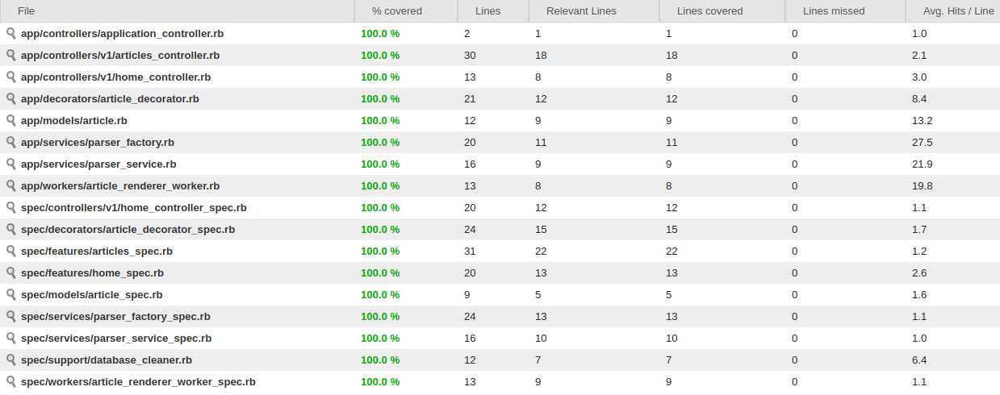

## O Desafio

Seu cliente é um blogueiro que foi hackeado e teve seu blog apagado.

Sendo assim ele precisa de um formulário onde ele pode preencher o título e o texto geral em formato markdown. Também deseja que a página inicial contenha a listagem das postagens e que seja possível visualizar essas postagens no formato final (já convertidos de markdown para HTML).

### Desafio:
O blogueiro deve conseguir fazer posts em markdown.

#### O que é esperado:
- Implementar um background job (processador de trabalhos assincronos), para fazer a conversão de markdown para html.
- Uma página com a listagem das postagens
- Uma página para criação das postagens
- Uma página para visualização das postagens já convertidas
- Testes automatizados
- Utilizar Ruby on Rails
- Ferramenta de versionamento de código

# Iniciando a aplicação

`docker-compose build`

`docker-compose run --rm website bundle install`

`docker-compose run --rm website bundle exec rake db:create db:migrate db:seed`

`docker-compose up`

# Aplicação

**Acesso publico**

`localhost:3000/` - Lista todos os artigos processados<br />
`localhost:3000/:SLUG` - Visualiza um artigo<br />

**Acesso privado**

`localhost:3000/users/sign_in` - Efetua login<br />
`localhost:3000/articles` - Lista todos os artigos<br />
`localhost:3000/articles/new` - Cria um novo artigo<br />

**Usuário para login**

E-mail: admin@admin.com <br />
Password: 123mudar

Obs: O Usuário é criado ao executar o db:seed

# Rodando os tests

`docker-compose run --rm website bundle exec rspec -fd`

```
V1::ArticlesController
  GET #new
    when signed user
      returns http success
    when not signed user
      return http status 302
  POST #create
    with valid params
      create a new article
    with invalid params
      desnt create a new article

V1::HomeController
  GET #index
    returns http success
  GET #show
    returns http success

ArticleDecorator
  When the body isnt rendered
    returns processing message
  Whe the body is rendered
    returns a html

Articles
  #new
    When fill with the valid values
      show to the article details
      redirect to the correct page

Home
  When access the index
    render the title Todos os artigos
    render all articles

Article
  validations
    should validate that :title cannot be empty/falsy
    should validate that :body cannot be empty/falsy

ParserFactory
  When type is HTML
    returns a correct html
  When type is STRING
    returns a clean string
  When type doesnt exist
    raise a exception

ParserService
  #html
    returns a correct html
  #preview
    returns a clean string

ArticleRendererWorker
  When a message arrives
    renderer correct html

Finished in 1.36 seconds (files took 1.08 seconds to load)
20 examples, 0 failures
```
